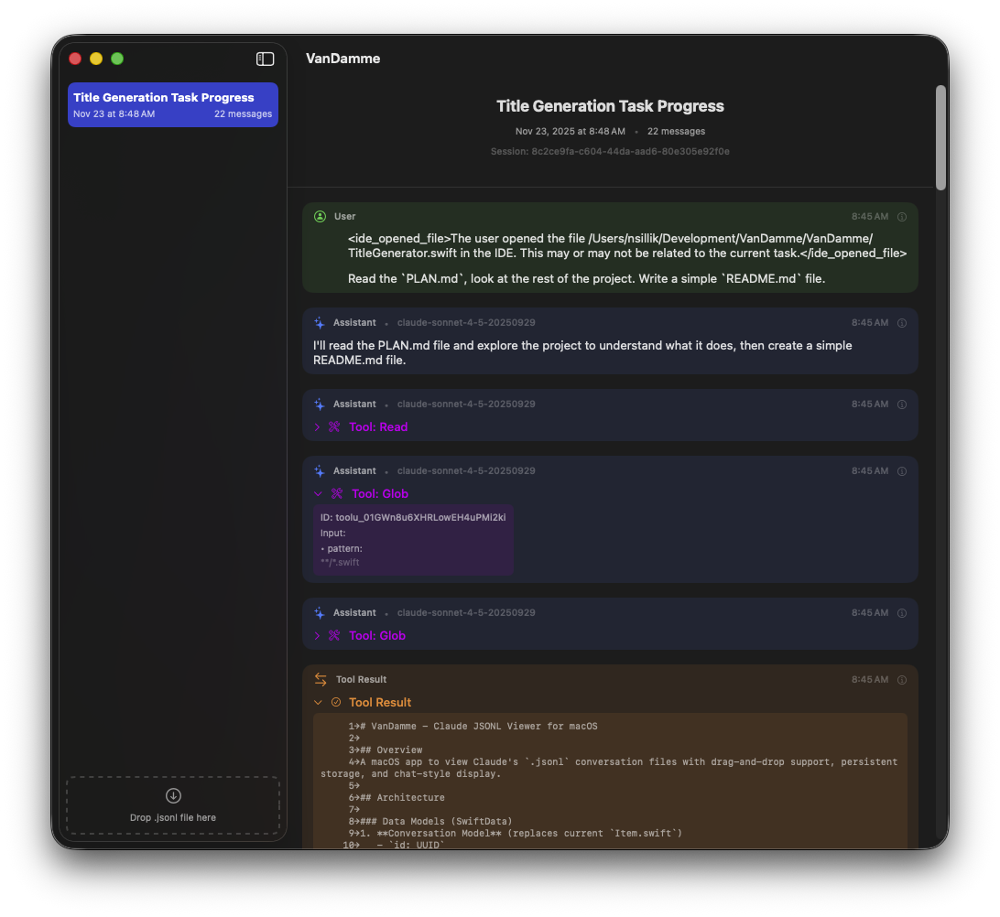

# VanDamme

A native macOS app for viewing Claude conversation files (`.jsonl` format) with an elegant, chat-style interface.

## Features

- **Drag & Drop Import**: Simply drag `.jsonl` files into the app to import conversations
- **Chat-Style Display**: View conversations in a familiar message bubble format with visual differentiation between user and assistant messages
- **Rich Message Content**: Support for text, tool uses, and tool results with collapsible sections
- **Automatic Titles**: AI-generated conversation titles using Apple's on-device Foundation Models
- **Persistent Storage**: Conversations are saved locally using SwiftData
- **Metadata Display**: View timestamps, token usage, model information, and message UUIDs
- **Conversation Management**: Rename and delete conversations with context menu actions



## Requirements

- macOS 15.0 or later
- Xcode 16.0 or later (for building from source)

## Installation

1. Clone the repository:
   ```bash
   git clone https://github.com/yourusername/VanDamme.git
   cd VanDamme
   ```

2. Open the project in Xcode:
   ```bash
   open VanDamme.xcodeproj
   ```

3. Build and run the project (⌘R)

## Usage

1. Launch VanDamme
2. Drag and drop a `.jsonl` conversation file from Claude onto the sidebar
3. The conversation will be imported and a title will be automatically generated
4. Click on a conversation in the sidebar to view its messages
5. Right-click on a conversation to rename or delete it

## Project Structure

- **Models**: `Conversation` and `Message` data models using SwiftData
- **Views**: SwiftUI views including `ContentView`, `ConversationDetailView`, and `MessageBubbleView`
- **Utilities**: `JSONLParser` for parsing `.jsonl` files and `TitleGenerator` for AI-powered titles
- **Drag & Drop**: `FileDropDelegate` for handling file imports

## License

MIT License - feel free to use this project as you wish.
